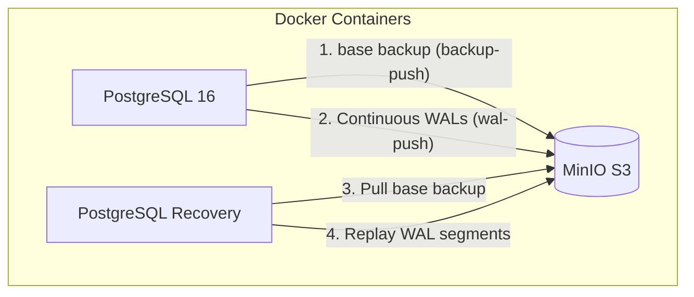

# Lab 01: Basic S3 Backup & Point-in-Time Recovery (PITR)

This example demonstrates how to set up continuous WAL archiving and base backups using **WAL-G** with an S3-compatible backend (**MinIO**), and how to perform **Point-in-Time Recovery (PITR)** to recover the database state just prior to a simulated disaster.

---

## Architecture & How It Works



### Key Concepts

1. **Base Backup (`backup-push`)**:
   WAL-G compresses, encrypts (optional), and uploads a physical copy of the PostgreSQL data directory to S3.
2. **Continuous WAL Archiving (`wal-push`)**:
   PostgreSQL executes the `archive_command` every time a WAL segment (16MB by default) is completed, or when forced (via `pg_switch_wal()`). WAL-G compresses and uploads these segments to S3.
3. **Point-in-Time Recovery (PITR)**:
   In the event of database corruption or accidental deletion, we can:
   - Restore the latest base backup that occurred *before* our target recovery time.
   - Replay the subsequent WAL segments from S3 using WAL-G `wal-fetch`.
   - Stop replaying at the exact millisecond (`recovery_target_time`) prior to the corruption.

---

## Configuration Details

### PostgreSQL Archiving Configuration
PostgreSQL is started with the following flags to enable WAL-G archiving:
- `wal_level = replica`: Ensures the WAL contains enough information to support archiving and replication.
- `archive_mode = on`: Enables archiving.
- `archive_command = 'wal-g wal-push "%p"'`: Specifies the shell command to execute to archive a completed WAL file. `%p` is replaced by the path of the file to archive.
- `archive_timeout = 60`: Forces PostgreSQL to switch to a new WAL file at least once every 60 seconds (useful in test environments to avoid waiting for a full 16MB file).

### WAL-G Environment Variables
WAL-G is configured via environment variables injected into the PostgreSQL container:
- `WALG_S3_PREFIX`: Prefix path for the S3 bucket (`s3://walg-backups`).
- `AWS_ACCESS_KEY_ID` & `AWS_SECRET_ACCESS_KEY`: Access credentials for MinIO.
- `AWS_ENDPOINT`: Endpoint URL for the MinIO server (`http://minio:9000`).
- `AWS_S3_FORCE_PATH_STYLE`: Required for MinIO/local S3 compatibility (uses path-style URLs instead of virtual-host style).
- `AWS_REGION`: Dummy region (`us-east-1`) required by the AWS SDK.

---

## Step-by-Step Execution Guide

### Prerequisites
Make sure you have `docker`, `docker compose`, and `make` installed.

### 1. Launch the Lab
Spin up PostgreSQL, MinIO, and auto-create the S3 bucket:
```bash
make up
```

### 2. Initialize the Database
Seed the database with the initial table and records:
```bash
make init-db
```
This runs `sql/01_init.sql`, which creates an `inventory` table with 3 items.

### 3. Trigger a Base Backup
Instruct WAL-G to take a base backup of the database:
```bash
make backup
```
The backup files will be visible in the MinIO web console at [http://localhost:9001](http://localhost:9001) (Credentials: `minioadmin` / `minioadmin`).

### 4. Perform New Transactions
Insert additional items to simulate ongoing database updates:
```bash
make add-data
```
This runs `sql/02_insert.sql` to add 2 new records, runs `SELECT pg_switch_wal();` to immediately archive the WAL logs, and writes the current timestamp to `restore_time.txt` on your host.

### 5. Simulate a Disaster
Drop the table to simulate an accidental deletion:
```bash
make disaster
```
If you query the table now, it will return an error because the table no longer exists.

### 6. Perform PITR Restoration
Restore the database to the exact state recorded in step 4:
```bash
make restore
```
**Under the hood, this target does the following:**
1. Stops the running PostgreSQL container.
2. Deletes the active database files in the `pgdata` volume.
3. Invokes `wal-g backup-fetch` to pull down the base backup.
4. Creates a `recovery.signal` file in the data directory (notifies PostgreSQL 16 to start in recovery mode).
5. Configures `postgresql.auto.conf` with:
   - `restore_command = 'wal-g wal-fetch "%f" "%p"'`
   - `recovery_target_time = '<timestamp>'` (read from `restore_time.txt`)
   - `recovery_target_action = 'promote'` (opens the database as read-write after recovery completes)
6. Starts the PostgreSQL container.
7. PostgreSQL automatically fetches and replays WAL files from MinIO up to the specified target time, then promotes the database.

### 7. Verify Recovery
Check the database to verify the restored state:
```bash
make verify
```
You should see all 5 records (the 3 initial records plus the 2 inserted after the backup). The table drop did not affect our restored instance!

### 8. Cleanup
To stop containers and wipe volumes:
```bash
make down
```
