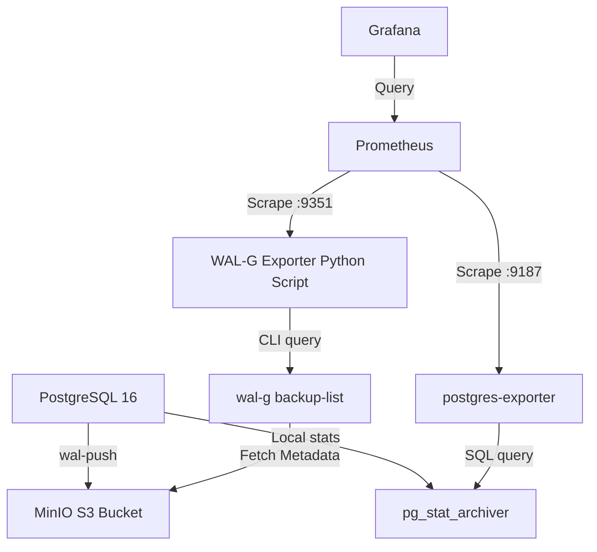

# Example 3: WAL-G & PostgreSQL Monitoring with Prometheus and Grafana

This lab demonstrates how to monitor **WAL-G base backups** and **PostgreSQL WAL archiving** using **Prometheus**, **Grafana**, and a custom **WAL-G metrics exporter**.

---

## Architecture Overview

Continuous database backups and archiving must be monitored closely in production. If backups or WAL archiving fails, you risk data loss and filling local disks.



1.  **PostgreSQL 16**: Configured with `archive_command` to invoke WAL-G.
2.  **MinIO**: Emulated S3 object storage bucket.
3.  **WAL-G Exporter (`walg_exporter.py`)**: A lightweight background service running on port `9351` in the Postgres container. It queries `wal-g backup-list --json --detail` and formats the metadata into Prometheus gauge metrics.
4.  **Postgres Exporter**: The official Prometheus exporter for PostgreSQL, scraping database-level stats including `pg_stat_archiver` (failed/archived WAL count).
5.  **Prometheus**: Scrapes metrics from both exporters.
6.  **Grafana**: Pre-configured with a Prometheus data source and a custom **WAL-G Backup & Archiving** monitoring dashboard.

---

## Exposed Observability Metrics

### WAL-G Backup Metrics (from `walg-exporter:9351`)

| Metric | Type | Description |
| :--- | :--- | :--- |
| `walg_scrape_success` | Gauge | `1` if the exporter successfully queried WAL-G, `0` otherwise. |
| `walg_backups_total` | Gauge | Total number of WAL-G base backups found in S3 storage. |
| `walg_last_backup_timestamp` | Gauge | Epoch timestamp of the last completed base backup. |
| `walg_last_backup_uncompressed_bytes` | Gauge | Uncompressed size of the last base backup. |
| `walg_last_backup_compressed_bytes` | Gauge | Compressed size of the last base backup in storage. |
| `walg_last_backup_duration_seconds` | Gauge | Time in seconds taken to complete the last base backup. |

### PostgreSQL WAL Archiving Metrics (from `postgres-exporter:9187`)

| Metric | Type | Description |
| :--- | :--- | :--- |
| `pg_stat_archiver_archived_count` | Counter | Total number of WAL segments successfully archived. |
| `pg_stat_archiver_failed_count` | Counter | Total number of failed WAL archiving attempts. |

---

## Step-by-Step Lab Execution

### 1. Build and Start Services
Spin up the entire stack using Docker Compose:
```bash
make up
```
*This command launches PostgreSQL, MinIO, Prometheus, Grafana, and postgres-exporter, and waits for them to accept connections.*

### 2. Initialize Database & Generate Base Backup
Create the schema and seed the initial table:
```bash
make init-db
```
Then trigger a base backup via WAL-G to generate our first set of backup metrics:
```bash
make backup
```

### 3. Insert Data & Archive WAL Logs
Add new records and switch the active WAL segment to trigger immediate archival:
```bash
make add-data
```

### 4. Verify Metrics via CLI
Check the output of the WAL-G exporter directly:
```bash
make status
```
*You will see the metrics showing 1 base backup, the backup size, and its duration.*

### 5. Access the Grafana Dashboard
1.  Open your browser and navigate to **[http://localhost:3000](http://localhost:3000)**.
2.  Log in using the default credentials:
    *   **Username:** `admin`
    *   **Password:** `admin`
3.  Go to **Dashboards** and select the **WAL-G Backup & Archiving Monitoring** dashboard.
4.  You will see visual gauges and statistics matching the metrics generated during the steps above.

---

## Production Security Considerations

When implementing this monitoring stack in production, keep the following security practices in mind:

### 1. Protect Exporter Credentials
The `walg_exporter` runs CLI commands that require access to the S3 bucket's credentials (`AWS_ACCESS_KEY_ID`, `AWS_SECRET_ACCESS_KEY`).
*   **Recommendation:** Secure the environment variables in a protected directory (e.g., `/etc/wal-g.d/env`) readable only by the `postgres` user, rather than placing them in cleartext docker-compose/process configurations.

### 2. Network Isolation
Exporters (`walg_exporter` on `9351` and `postgres_exporter` on `9187`) do not typically implement authentication.
*   **Recommendation:** Bind these exporters to localhost (`127.0.0.1`) or restrict access using firewalls/security groups so that only the Prometheus scraping instance can query the endpoints.

### 3. Grafana & Prometheus Access Control
*   Change the default Grafana administrative password immediately.
*   Integrate Grafana with single sign-on (SSO) or OAuth (such as GitHub, Google, or Active Directory) in production.
*   Secure Prometheus with basic authentication or a reverse proxy (e.g., Nginx) to prevent unauthorized querying of system telemetry.

---

## Cleanup
When finished, tear down the containers and their volumes:
```bash
make down
```
